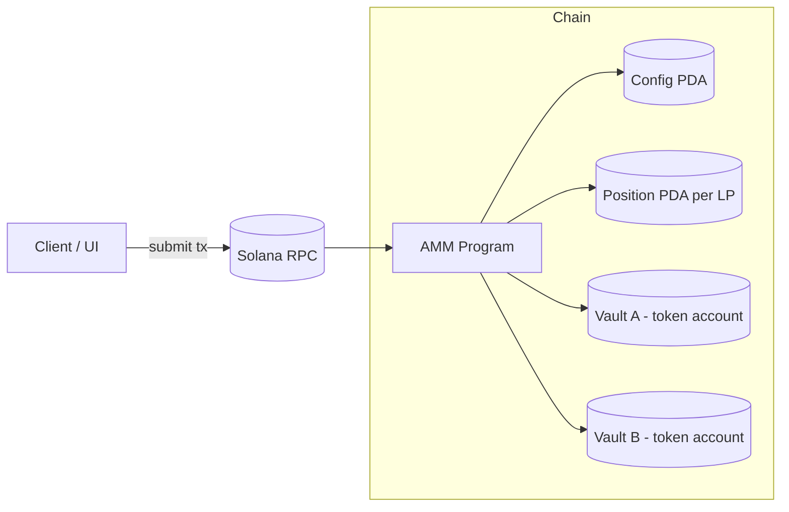

# AMM Anchor program

## Architecture



## Program instructions

- `init`: create the `Config` PDA and token vaults. `fee` is in bps and `authority` is an optional admin key.
- `deposit`: open or grow the caller's `Position`. On first deposit (`total_liquidity == 0`) `(max_x, max_y)` are taken directly as the initial reserves and `amount` is the liquidity minted. On subsequent deposits the proportional `(x, y)` is computed from current reserves and validated against the caller's caps. Any pending fees on an existing position are settled into `fee_owed_*` before liquidity changes late LPs snapshot the current global growth so they earn nothing from past swaps.
- `withdraw`: settle pending fees, reduce `position.liquidity` and `config.reserve_*` proportionally, then pay the LP `principal + fee_owed` in a single transfer per side. `min_x` / `min_y` are slippage floors on the principal.
- `swap`: `direction` is `AtoB` or `BtoA`. The curve reads from `config.reserve_*`, the full `amount` (including fee) enters the vault, `reserve_input += after_fee` and `reserve_output -= delta_out`. The fee portion stays in the vault as uncollected fees, and `fee_growth_{input_side}` advances by `(fee << 64) / total_liquidity`. `min` is the minimum acceptable output (slippage).
- `collect_fees()`: settle pending growth into `fee_owed_*`, transfer those balances from the vault to the LP, then zero `fee_owed_*`. Position liquidity is untouched.
- `set_locked`: admin pause/unpause deposits, withdrawals, swaps, and fee collection.
- `set_fee`: admin update the swap fee (bps). Only affects fee taken on swaps after the change; already-accumulated `fee_growth_*` is unaffected.
- `set_authority`: admin transfer or renounce admin authority.

## Running tests

Tests require a running local validator and the program deployed locally (Anchor). Typical commands:

```sh
# Run TypeScript tests
anchor test

# Run LiteSVM tests
anchor run testsvm
```
