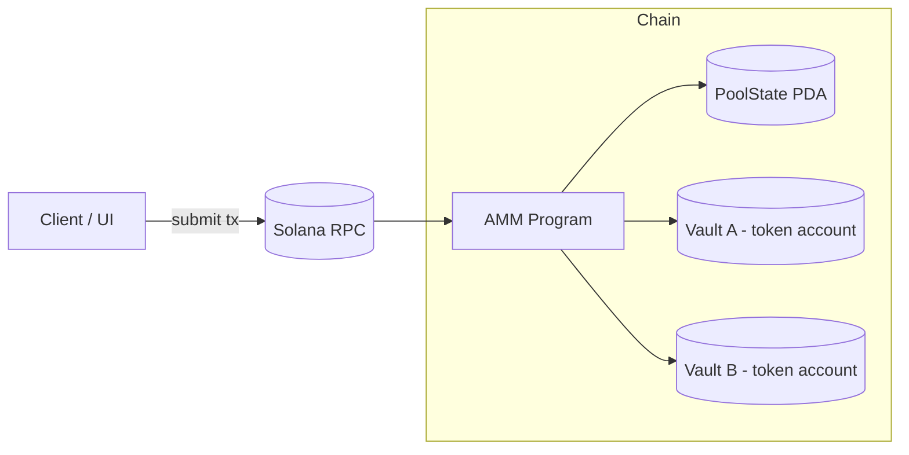

# AMM Anchor program

## Architecture



## Program instructions (summary)

- `init` — create a new pool `Config` PDA, initialize LP mint (`mint_lp`) and token vaults (`vault_a`, `vault_b`). `fee` is in bps and `authority` is an optional admin key.
- `deposit` — deposit tokens into the pool. `amount` is the amount of LP tokens to mint (when creating liquidity) or desired LP amount to receive; `max_x`/`max_y` are the maximum token A/B the caller is willing to deposit (slippage protection).
- `withdraw` — burn `amount` LP tokens to withdraw underlying token amounts; `min_x`/`min_y` are minimum acceptable outputs.
- `swap` — swap tokens. `direction` is `AtoB` or `BtoA`, `amount` is the input amount, and `min` is the minimum acceptable output.
- `set_locked` — admin instruction to lock or unlock the pool (prevents deposits/withdraws/swaps while locked).

## Running tests

Tests require a running local validator and the program deployed locally (Anchor). Typical commands:

```sh
# Run Anchor + TypeScript tests
anchor test

# Run LiteSVM tests
anchor run testsvm
```
## Build / lint / format

Use the workspace commands where applicable:

```sh
anchor build
pnpm test
pnpm format
pnpm format:check
```
